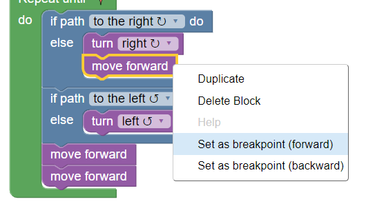

# Demo 🕹️

### This demo is a remake with `gamepad.js` of the [Maze](https://blockly-games.appspot.com/maze) game. 
### Clicke [here](https://paol-imi.github.io/gamepad.js/demo) to try it, in the console you'll find the state logs. Try the debug right clicking on a block!.

<br>




<br>

Clone the project to see the commented code.

```
git clone https://github.com/Paol-imi/gamepad.js.git
cd docs/demo
explorer index.html
```

