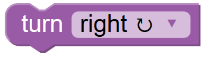
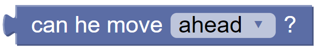
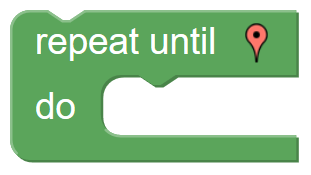
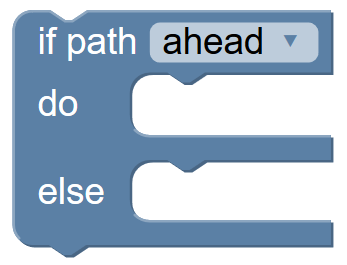

## Blocks {docsify-ignore}

Blocks can be defined with the `init` function.

```javascript
Blockly.Gamepad.init({
    blocks: {
        'move_block': {
            ...
        },
        'turn_block': {
            ...
        }
    }
})
```

## Requests model

> Each block generate a `request`.

> Each time a block is executed, the corresponding `request` is passed to the game.

here's an `example` of a request.

```javascript
{ method: 'MOVE', args: ['UP'] }
```

## Block structure {docsify-ignore}

When setting up a block there are basically 2 things to set:

-   how the [block](blocks?id=block-information) has to be.
-   how to generate the [request](blocks?id=request-information).

## Block information

It's possible to use the `json` or the `javascript` format to define the blocks. <br>
See the Blockly's [documentation](https://developers.google.com/blockly/guides/create-custom-blocks/define-blocks#json_format_versus_javascript_api).

### json
```javascript
'move_up': {
    json: {
        // type: 'move_up'   is automatically setted
        'message0': 'Move up %1',
        'args0': [{
            'type': 'field_image',
            'src': 'move_up.png',
            'width': 15,
            'height': 15,
            'alt': '*'
        }],
        'previousStatement': null,
        'nextStatement': null
    }
}
```

### javascript 
```javascript
'string_length': {
    javascript: {
        init: function() {
            this.appendValueInput('VALUE')
                .setCheck('String')
                .appendField('length of');
            this.setOutput(true, 'Number');
            this.setColour(160);
            this.setTooltip('Returns number of letters in the provided text.');
        }
    }
};
```


## Request information

A request has the following properties:

-   [method](blocks?id=method)
-   [args](blocks?id=args)

```javascript
{ method: 'MOVE', args: ['UP'] } // the request
```

### Method

- type: `String`
- default: `empty string`

The method of the request.

```javascript
'move_up': {
    method: 'MOVE'
}
```

### Args

- type: `Array`
- default: `empty array`

The arguments of the request, for each argument there are the following `options`.

#### Value

```javascript
args: [{
    value: 'UP' // the value is added to the args
}}
```

#### Field

```javascript
args: [{
    field: 'colour' // the value is taken from the block's input field named 'colour'
}}
```
```javascript
// the block will have a field like that
'move_up': {
    json: {
        'args0': [{
            'type': 'field_colour',
            'name': 'colour', // the value is taken from this field
            'colour': '#2ECC71'
        }],
        ...
    }
}
```

#### Input

```javascript
args: [{
    input: 'UP' // shortcut for Blockly.Gamepad['INPUTS']['UP']
}}
```

#### Get

```javascript
args: [{
    field: 'number',
    get: function(value){
        // do something with the value...
        return value // this value will be stored in the request's args
    }                             
}}
```

## Order

The `operator precedence`. See the Blockly's [documentation](https://developers.google.com/blockly/guides/create-custom-blocks/operator-precedence)

```javascript
'block': {
    order: Blockly.JavaScript.ORDER_NONE
}
```

## Templates

There are some `templates` for the blocks.

-   `While`
-   `Do while`
-   `If`
-   `If else`

These Templates define the main `structure` of a block.
Together with the template it is necessary to set also the name of the `input_statement` that will contain the child blocks.

```javascript
'repeat_until': {
    template: Blockly.Gamepad['TEMPLATES']['WHILE'],
    statements: ['DO'], // the input name
    json: {
        'message0': 'while %1 do %2',
        'args0': [
            {
                'type': 'input_dummy'
            },
            {
                // the child blocks are linked here
                'type': 'input_statement',
                'name': 'DO' // the input name
            }
        ]
    }
}

```

See also the [examples](blocks?id=repeat-until) below.

## Update the toolbox

It's possible to dynamically change the `toolbox` by choosing the `blocks` to be displayed. Categories with no block to display will be hidden. 

```javascript
gamepad.setToolbox({
    blocks: [
        'move_up',
        'move_down'
        ...
    ]
})


// to display all the blocks
gamepad.setToolbox({
    all: true
})
```

## Examples
#### Turn


```javascript
'turn': {
    method: 'TURN',
    args: [{
        field: 'DIRECTION' // the name of the input field
    }],
    json: {
        'message0': 'turn %1',
        'args0': [{
            'type': 'field_dropdown',
            'name': 'DIRECTION', // the name of the field
            'options': [ // directions
                ['right ↻', 'RIGHT'], 
                ['left ↺', 'LEFT']
            ]
        }],
        'previousStatement': null,
        'nextStatement': null,
        'colour': 285
    }
}
```

That block will generate this request.

```javascript
{ method: 'TURN', args: ['RIGHT'] }
```
And in the game.

```javascript
class Game{
    manageRequest(request){
        if(request.method === 'TURN')
            return this.TURN.apply(this, request.args)
    }

    TURN(direction){
        if(direction === 'RIGHT') {
            // turn right
        }
        
        if(direction === 'LEFT') {
            // turn left
        }
    }
}
```
#### Can he move


```javascript
'can_move': {
    method: 'PATH',
    args: [{
        field: 'DIRECTION' // the name of the input field
    }],
    // order must be provided for blocks with an output
    order: Blockly.JavaScript.ORDER_NONE,
    json: {
        'type': 'block_type',
        'message0': 'can he move %1 ?',
        'args0': [
            {
                'type': 'field_dropdown',
                'name': 'DIRECTION', // the name of the field
                'options': [ // directions
                    ['ahead', 'AHEAD']
                ]
            }
        ],
        // this block will return the "return value" provided by the game
        'output': 'Boolean',
        'colour': 230
    }
}
```

That block will generate this request.

```javascript
{ method: 'PATH', args: ['AHEAD'] }
```
And in the game.

```javascript
class Game{
    manageRequest(request){
        if(request.method === 'PATH')
            return this.PATH.apply(this, request.args)
    }

    PATH(direction){
        if(direction === 'AHEAD') 
            return {
                return: this.isPathAheadAvaible // true or false
            }

        // this.isPathAheadAvaible will be the return value of the block
        // and it is a Boolean => 'output': 'Boolean'
    }
}
```

#### Repeat until


```javascript
'repeat_until': {
    method: 'REPEAT',
    statements: ['DO'], // the input name
    template: Blockly.Gamepad['TEMPLATES']['WHILE'], // template
    json: {
        'message0': 'Repeat until %1 %2 do %3',
        'args0': [{
            'type': 'field_image',
            'src': 'location.png',
            'width': 15,
            'height': 15,
        },
        {
            'type': 'input_dummy'
        },
        {
            // the child blocks are linked here
            'type': 'input_statement',
            'name': 'DO' // the input name
        }],
        'previousStatement': null,
        'colour': 120,
    }
}
```

That block will generate this request.

```javascript
{ method: 'REPEAT', args: [] }
```
And in the game.

```javascript
class Game{
    manageRequest(request){
        if(request.method === 'REPEAT')
            return this.REPEAT()
    }

    
    REPEAT(){
        if(this.isArrived) 
            return {
                return: false // will stop the while cycle
            }
        else
            return {
                return: true // will continue the while cycle
            }

        // while ( return: ) {...}
    }
}
```

#### If else path



```javascript
'if_path': {
    method: 'REPEAT',
    args: [{
        field: 'OPTIONS' // the name of the input field
    }],
    statements: ['DO', 'ELSE'], // statements
    template: Blockly.Gamepad['TEMPLATES']['IF_ELSE'], // template
    json: {
        'message0': 'if path %1 %2 do %3 else %4',
        'args0': [{
            'type': 'field_dropdown',
            'name': 'OPTIONS', // the name of the field
            'options': [
                [ 'ahead', 'AHEAD' ],
                [ 'right', 'RIGHT' ],
                [ 'left', 'LEFT' ]
            ]
        },
        {
            'type': 'input_dummy'
        },
        {
            'type': 'input_statement', // if true this blocks will be executed
            'name': 'DO'
        },
        {
            'type': 'input_statement', // if false this blocks will be executed
            'name': 'ELSE'
        }],
        'previousStatement': null,
        'nextStatement': null,
        'colour': 210
    }
}
```


That block will generate this request.

```javascript
{ method: 'PATH', args: ['AHEAD'] }
```
And in the game.

```javascript
class Game{
    manageRequest(request){
        if(request.method === 'PATH')
            return this.PATH.apply(this, request.args)
    }

    PATH(direction){
        if(direction === 'AHEAD') 
            return {
                return: this.isPathAheadAvaible // true or false
            }

        // if ( return: ) {...} else {...}
    }
}
```

## Start block

If it's enabled it's possible to customize the `start` block.

```javascript
Blockly.Gamepad.init({
    blocks: {
        Blockly.Gamepad['BLOCKS']['START']: {
            ...
        }
    }
})
```