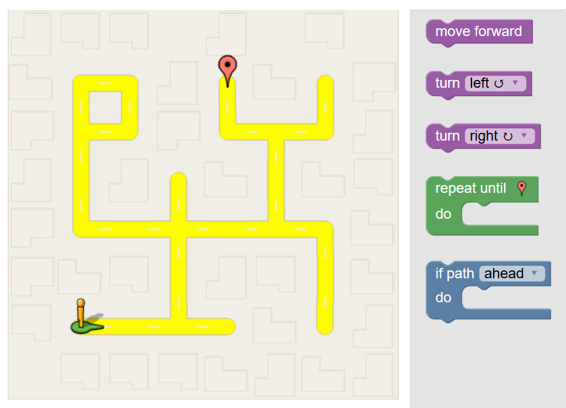

# Magic json 🧙

> This is the `magic` part of the library.

```javascript
let gamepad = new Blockly.Gamepad({
    'magicJson': true
})
```

!> to understand this chapter it is first necessary to read the [`workflow`](https://paol-imi.github.io/blockly-gamepad/#/workflow) chapter.


## The Maze

-   To understand this feature let's take as an example the [Maze](https://paol-imi.github.io/blockly-gamepad/demo) game. 



-   The state of each `level` can be described with a `json` like that.

```javascript
{
    'pegman': {
        'x': 0,
        'y': 0,
        'direction': 1
    },
    'marker': {
        'x': 3,
        'y': 5
    },
    ...
}
```

-   When a `request` is generated, for example that one.

```javascript
{ method: 'MOVE', args: ['UP'] }
```

-   The game has to `manage` it.

```javascript
class Game{
    constructor(level){
        this.level = level
    }

    onRequest(request){
        this[request.method].apply(this, request.args)
    }

    MOVE(direction){
        if(direction === 'UP') this.level.pegman.y++
    }
}
```

-   Now let's assume thet the game have to manage also `backward` requests. The code will be something like that.

```javascript
class Game{
    constructor(level){
        this.level = level
    }

    onRequest(request, back){
        this[request.method].apply(this, [back].concat(request.args))
    }

    MOVE(back, direction){
        if(direction === 'UP') this.level.pegman.y += back ? -1 : 1
    }
}
```

-   For this single method it was quite simple, but if the game was more `complicated`?
Let's set up the game in this way.

```javascript
class Game{
    constructor(gamepad, level){
        this.gamepad = gamepad
        this.gamepad.level = level
    }

    onRequest(request, back, old){
        if(!old) this[request.method].apply(this, request.args)

        console.log(
            'y: ', this.gamepad.level.pegman.y
        )
    }

    MOVE(direction){
        if(direction === 'UP') this.gamepad.level.pegman.y++
    }
}
```

Take some time to view this code. Now the game seems to do less than before, not only it doesn't manage backward requests but now it doesn't even manage forward requests if they are `old`.

Here's the `magic` thing. 🧙

> Once the gamepad has `learned` how to change the json in a new request, when that request is passed a second time to the game the changes are applied `automatically`.

## Zoom-in 🔍

This is the json.

```javascript
'pegman': {
    'x': 0, 
    'y': 0
}
...
```

```javascript
gamepad.forward()
> 'y: 1' // as expected
```

```javascript
gamepad.backward()
> 'y: 0' // what?
```

```javascript
gamepad.forward()
> 'y: 1' // what?x2
```

You `don't need to write any code` to manage old requests.
I suggest you to see this [demo](https://github.com/Paol-imi/blockly-gamepad/tree/master/docs/demo) to understand even better how this option work.

## How it works

When this feature is enabled the magic json is stored in `gamepad.level`. the json `doesn't work` as a normal object.

### Assignment

```javascript
let json = {
    'pegman': {
        'x': 0,
        'y': 0
    }
}

// now gamepad.level is magic
gamepad.level = json
```
The `assignment` won't affect the normal json. Only gamepad.level is `magic`.
```javascript
// json is still a normal object
//
// now json and gamepad.level are different objects, 
// changing on of them won't change the other
console.log(
    gamepad.level !== json
)

// expected output
> true
```
```javascript
// let's try
gamepad.level.pegman.x = 1
// log the result
console.log(
    gamepad.level.pegman.x,
    json.pegman.x
)

// expected output
> '1'
> '0'
```

This is true for `every assignment`.

```javascript
let position = {
    'x': 1,
    'y': 1
}

gamepad.level.pegman.position = position

// log the result
console.log(
    gamepad.level.pegman.position !== position
)

// expected output
> true
```
### Tested changes

These are all the `changes` that the magic json should support.

#### Objects

```javascript
// assigment
gamepad.level.obj = {}

// delete
delete gamepad.level.obj
```

#### Arrays

```javascript
gamepad.level.array = []

// assignment
gamepad.level.array[0] = 'value'

// push
gamepad.level.array.push('value')

// pop
gamepad.level.array.pop()

// unshift
gamepad.level.array.unshift('value')

// shift
gamepad.level.array.shift()

// splice
gamepad.level.array.splice()

// fill
gamepad.level.array.fill('value')

// reverse
gamepad.level.array.reverse()

// sort
gamepad.level.array.sort()

// assignment with a non number index
gamepad.level.array['e'] = 'value'
```

### Multi-level game

If the game has more than one level it's possible to store an array of levels in `gamepad.levels`. Each item of the array must be a json that represent the corresponding level.  

```javascript
gamepad.levels = [
    // level 1
    { id: '1' }, 
    // level 2
    { id: '2' },
    // level 3
    { id: '3' }
]
```

The game has to be `loaded` with the corresponing number of levels.
```javascript
// load 3 levels
gamepad.load(gamepad.levels.length)
```
Now the current level is stored in `gamepad.level`. The current level will change automatically with the `'START'` / `'FINISHED'` states.
```javascript
gamepad.levels = [
    // level 1
    { id: '1' }, 
    // level 2
    { id: '2' },
    // level 3
    { id: '3' }
]

console.log(
    gamepad.level
)

// expected output
> { id: '1' }
```
When the level end.
```javascript
...
{ method: Blockly.Gamepad['STATES']['FINISHED'] }
                // old level finished
                // next level started
{ method: Blockly.Gamepad['STATES']['STARTED'] }
// -- you are here
...
```
The json is changed.
```javascript
// log the result
console.log(
    gamepad.level
)

// expected output
> { id: '2' }
```
I suggest you to see this [game](https://github.com/Paol-imi/the-aviator) to understand even better how this option work.

### On load

When the game is loaded the `levels` are automatically `resetted`.

```javascript
gamepad.load()
```