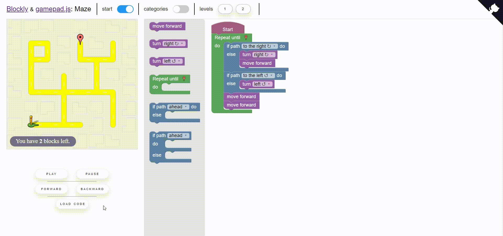

# Blockly-gamepad 🎮

This library was created with the aim of facilitating the creation of game such as the [Maze](https://github.com/Paol-imi/blockly-gamepad/tree/master/docs/demo) allowing you to interact `asynchronously` with Blockly as you can see in the gif below.



With blockly-gamepad you no longer need to use an `interpreter` or even a `code generator`! The concept is simple:
<br>
1. _A **block** is executed_
2. _Your game receives a **request** containing the information of the block_
2. _Your game **manages** the request_
<br>

That's it.

## How it works 📘

At first You have to define the structure of the blocks `without any code generator`. All that concerns the generation of code is carried out by the library (See how to define the blocks in this [chapter](https://paol-imi.github.io/blockly-gamepad/#/blocks)).


Each block generate a `request`.

```javascript
{ method: 'TURN', args: ['RIGHT'] }
```

When a block is executed the corresponding request is passed to your `game`.

```javascript
class Game{
    manageRequests(request){
        // requests are passed here
        if(request.method == 'MOVE')
            // move the sprite
            move(request.args)
    }
}
```

Usually the graphic part of the game has some animations that are processed `asynchronously`. it's possible to manage them using `promises`.

```javascript
class Game{
    async manageRequests(request){
        if(request.method == 'MOVE')
            await move(request.args)
    }
}
```

The link between the blocks and your game is managed by the `gamepad`.

```javascript
let gamepad = new Blockly.Gamepad(),
    game = new Game()

// requests will be passed here
gamepad.setGame(game, game.manageRequest)
```

Except in rare cases there is no need to interact with the `Blockly` library directly. The gamepad provides some methods to manage the blocks execution and consequently the `requests generation`.

```javascript
// load the code from the blocks in the workspace
gamepad.load()
// reset the code loaded previously
gamepad.reset()

// the blocks are executed one after the other
gamepad.play() 
// play backwards
gamepad.play(true)
// the blocks execution is paused
gamepad.pause()
// toggle play
gamepad.togglePlay()

// load the next request 
gamepad.forward()
// load the prior request
gamepad.backward()

// use a block as a breakpoint and play until it is reached
gamepad.debug(id)
```

Look at the next [chapter](https://paol-imi.github.io/blockly-gamepad/#/workflow).